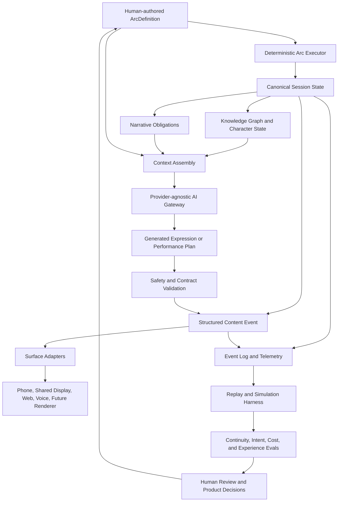

# Arcwright AI Capability Roadmap

> Current version: v1.0
> Last updated: 2026-07-25
> Status: Proposed product strategy artifact
> Canonical path: `docs/product/ai-capability-roadmap.md`
> Owner: Product Steward with System Architect and founder approval

## Purpose

This roadmap turns Arcwright's AI opportunity into an evidence-gated capability plan that can be handed to Codex for task decomposition and implementation planning.

It is deliberately not a promise to build an autonomous game generator. Arcwright's advantage is a reliable layer that lets human authors create adaptive experiences while preserving story intent, deterministic state, player agency, cost control, and inspectability.

The roadmap covers:

- Product strategy and possible pivots
- Architecture implications
- Build versus buy decisions
- Data and learning strategy
- Evaluation and quality gates
- Asset, animation, graphics, and UI production support
- Runtime AI and bounded adaptation
- Synthetic playtesting and session learning
- Frontier technologies and watch items
- Sequenced experiments and proposed epics
- Acceptance criteria and Codex handoff instructions

This document is a strategy and sequencing artifact. It does not approve implementation scope by itself. Product commitments require an entry in `docs/product/decisions-log.csv`; architecture, schema, telemetry, privacy, routing, and API changes require an ADR or approved implementation spec.

## Executive decision

Arcwright should become the authorial-intent and experience-orchestration layer for adaptive story worlds.

The order of operations is:

1. Make canonical story state reliable and inspectable.
2. Make AI output provably subordinate to that state.
3. Make sessions replayable and evaluable.
4. Use player and playtest evidence to improve authored experiences.
5. Add production acceleration for dialogue, performance, assets, animation, and UI.
6. Add bounded runtime adaptation only where it improves a named experience goal.
7. Keep renderer and model abstractions open for future world models and cross-media surfaces.

The most important product choice is what Arcwright will not optimize for. It should not optimize for unlimited dialogue, maximum session length, maximum generated content, or novelty for its own sake. It should optimize against author-defined goals such as comprehension, tension, surprise, meaningful agency, character consistency, emotional resonance, and group connection.

## Canonical baseline and non-negotiable constraints

The repository describes Arcwright as Layer 2 narrative runtime middleware. Humans author arc structure and constraints, the Python engine resolves session state deterministically, LLMs render from resolved state, and surfaces decide how structured events are displayed. Nightcap is the reference implementation.

The roadmap inherits these constraints from `AGENTS.md`, `README.md`, `docs/README.md`, `docs/architecture/`, `docs/prd/`, and accepted ADRs:

| Constraint | Roadmap consequence |
|---|---|
| Human arc primacy | AI may propose language, performance, or routing. It may not decide what happened or mutate canonical state. |
| Deterministic state transitions | Every adaptive feature needs a deterministic decision boundary, replay fixture, and rejection path. |
| Surface agnosticism | Engine outputs structured events. Renderer, dashboard, phone, shared display, voice, and future surfaces remain adapters. |
| Knowledge graph first | Character knowledge is mandatory context before character generation. |
| Authored versus generative dial | Each arc element declares whether it is authored, generated, or hybrid. |
| Provider-agnostic routing | Provider and model identifiers remain behind the routing abstraction and configuration boundary. |
| Cost-aware by default | Every capability has a budget tier, cache policy, latency target, fallback, and usage record. |
| Managed first, proprietary later | Do not train foundation models or own compute before volume, data quality, and economics justify it. |
| Python owns canonical runtime state | TypeScript remains presentation and input-submission code. |
| Product scope needs durable evidence | A roadmap idea is not build scope until recorded in canonical product and architecture documents. |

The repository already has important foundations and related roadmap work:

- Deterministic arc execution, knowledge constraints, content events, persistence, telemetry, and simulation harnesses.
- Authorial intent, narrative obligations, and continuity evals accepted in `docs/decisions/0012-authorial-intent-obligations-continuity-evals.md` and represented in M5-H.
- A visual storyworld inspection path in M5-D.
- Character behavior hardening in M5-E.
- Nightcap visual identity and asset pipeline work in M5-G.
- The Nightcap couch-race and interrogation direction in M5-I.
- Existing specs for scripted synthetic players, deterministic replay, pacing, knowledge-constrained dialogue, model routing, telemetry, and multi-agent operation.

This roadmap should be attached to those foundations, not treated as a replacement roadmap for M1 through M6.

## Product strategy

### Product thesis

Generative models will make raw content creation cheaper. They will not automatically make adaptive experiences coherent, emotionally effective, economically viable, or legally and operationally safe.

Arcwright's durable value should therefore sit in the control plane between human intent, canonical state, runtime AI, presentation systems, and measured player experience.

That control plane has five jobs:

1. Preserve what the author means.
2. Decide what is true and what is allowed.
3. Select how truth is expressed on the current surface.
4. Record what players actually experienced.
5. Help humans improve the experience without silently rewriting its meaning.

### Wedge and portfolio strategy

The current product records narrow Horizon 1 around adult social party games, with Nightcap as the wedge. The AI roadmap supports that strategy:

- Nightcap proves group personalization, knowledge boundaries, pacing, event delivery, privacy, and cost per session.
- A second social experience proves that the platform generalizes beyond one mystery.
- A future developer or studio integration proves that Arcwright is reusable middleware rather than a Nightcap-specific game backend.

Do not make the platform's first AI proof a chatbot NPC. Make it a short, polished experience where players can see that the same authored arc responds differently to the room while remaining coherent.

### Strategic options and pivot triggers

| Option | When it wins | What must be proven | Current posture |
|---|---|---|---|
| Social game studio with internal AI advantage | A small number of games create strong audience pull and the platform mainly compounds internal production | Repeatable production recipes, player retention, clear creative identity | Primary near-term path |
| Narrative middleware for studios | External teams repeatedly ask for deterministic adaptive runtime, evaluation, and integration | Time-to-integrate, reliability, support burden, margin per session, reusable SDK | Evidence-gated Horizon 2 |
| Experience intelligence and evaluation platform | Studios value intent fidelity, replay, synthetic testing, and playtest analysis more than runtime generation | Measurable reduction in escaped narrative defects and playtest cost | Strong adjacent option |
| Authoring and production assistant | Authors need structured arc tooling, asset provenance, and scene/performance planning | Workflow adoption without violating the current no-code authoring boundary | Watch, do not lead with it |
| Cross-media story operating system | The same story model can produce game scenes, live facilitation, audio, or animation | Renderer independence, author adoption, cross-surface quality | Long-term option |

Pivot only when an evidence gate is met. Examples include two design partners completing integration without bespoke engine changes, a measurable reduction in narrative defects, or a session-level cost and gross-margin profile that supports the desired business model.

### Strategic anti-goals

Arcwright should not:

- Train a general-purpose foundation model as an early product move.
- Build a full game engine, DCC, voice studio, or asset marketplace.
- Let a model author irreversible story consequences without a deterministic validator.
- Treat generated text as the product. The product is the experience and the control plane.
- Use behavioral telemetry to infer sensitive traits or manipulate players without explicit product justification and consent.
- Create a large authoring suite before proving a compelling runtime experience.
- Tie the platform to one renderer, model vendor, or asset-generation vendor.

## Capability map

### Horizon 0: protect the core

These capabilities are foundational and should be prioritized before broad runtime generation:

1. Structured authorial intent and emotional targets.
2. Narrative obligations and payoff accounting.
3. Knowledge graph and character-state inspection.
4. Deterministic replay and batch simulation.
5. Continuity, contradiction, and knowledge-leak evaluations.
6. Model routing, caching, budgets, fallbacks, and usage accounting.
7. Generation provenance and asset provenance.
8. Content safety and incident reporting.

### Horizon 1: make sessions legible

1. Session timeline reconstruction.
2. Intent-to-experience gap reporting.
3. Human playtest annotation and evidence linking.
4. Synthetic player panel with explicit behavioral profiles.
5. Narrative debugger explaining why a beat, response, or rejection occurred.
6. Cost, latency, quality, and failure dashboards.

### Horizon 2: accelerate production

1. Scene and beat breakdowns from structured arc data.
2. Performance specifications for voice, body, face, camera, and silence.
3. Asset registry with style, technical, licensing, and provenance metadata.
4. AI-assisted concept, prop, texture, motion, and UI iteration.
5. Reusable design-system and surface adapters.
6. Human approval queues for shippable assets and performances.

### Horizon 3: add bounded runtime adaptation

1. Dynamic banter and low-consequence dialogue.
2. Personalized recap and hint selection.
3. Controlled pacing and attention routing.
4. Player preference profiles with uncertainty and decay.
5. Local or edge models for latency-sensitive classification and expression.
6. Optional generated side content inside a canon-safe envelope.

### Horizon 4: frontier experiments

1. Multi-agent social simulation for pre-playtest exploration.
2. Counterfactual experience replay.
3. World-model adapters for non-canonical visual simulation.
4. Cross-media rendering from one structured story model.
5. Real-time performance direction and procedural acting.
6. Creator-controlled learning from approved session evidence.

Horizon 4 items are research bets, not product commitments.

## Reference architecture



### Authority boundaries

| Boundary | Authoritative component | AI role | Required guardrail |
|---|---|---|---|
| Arc progression | Deterministic arc executor | Suggest candidate beat or pacing option | Preconditions, conditions, and replay assertion |
| Facts and outcomes | Canonical session state | Extract or classify input | Validated command, never direct mutation |
| Character knowledge | Knowledge graph | Render from filtered knowledge | Mandatory knowledge query before generation |
| Relationship changes | Runtime rules | Recommend language or action | Explicit transition rule and audit event |
| Dialogue and narration | AI gateway plus safety validator | Compose expression | Structured prompt context, schema validation, fallback |
| Performance | Performance planner and surface adapter | Propose voice, gesture, camera, or timing | Style constraints, human approval for shippable assets |
| Player profile | Consent-aware profile service | Estimate preferences with uncertainty | No sensitive inference, decay, opt-out, inspectability |
| Session analytics | Event log and evaluation layer | Summarize and classify evidence | Retention policy, provenance, human review |

### Suggested capability interfaces

The first implementation specs should define interfaces, not a large agent framework:

- `ArcExecutor.resolve(input, state) -> ResolvedTransition`
- `KnowledgeGraph.query(character_id, state_version) -> KnowledgeSlice`
- `ObligationLedger.get_open(session_id) -> ObligationSet`
- `ContextAssembler.build(task, resolved_state) -> GenerationContext`
- `ModelRouter.generate(task, context, budget) -> ModelResult`
- `SafetyValidator.validate(result, context) -> ValidationResult`
- `EventLog.append(event) -> EventReceipt`
- `ReplayRunner.replay(seed, input_sequence, arc_version) -> ReplayResult`
- `EvaluationRunner.evaluate(replay, suite) -> EvaluationReport`
- `ProvenanceRegistry.record(output, inputs, approvals) -> ProvenanceRecord`

The exact Python types, storage tables, and API shape require an approved spec and ADR where appropriate.

### Runtime request path

1. A surface submits a typed player or host input.
2. Python validates the input against the current session and role.
3. The deterministic executor resolves the state transition.
4. The engine updates facts, knowledge, relationships, obligations, and event log.
5. The engine assembles a bounded generation context from resolved state.
6. The model router selects a task-specific quality tier within the session budget.
7. The AI gateway returns typed expression content or a performance plan.
8. Safety, schema, and arc-contract validators accept or reject the result.
9. The engine emits a structured content event with correlation and provenance metadata.
10. The surface renders the event.
11. Telemetry captures state, content, cost, latency, validation, and player response signals.

No model call may be the source of truth for steps 1 through 5.

## Data strategy

### Data products

| Data product | Contents | Primary use | Default handling |
|---|---|---|---|
| Arc data | Authored structure, constraints, intent, tone, allowed variation | Runtime execution and generation context | Canonical product data, versioned |
| Session event log | Inputs, transitions, events, state hashes, timestamps | Replay, debugging, evaluation, analytics | Minimize, encrypt, retain by policy |
| Knowledge graph | Facts, belief, provenance, confidence, time, source | Character-constrained generation | Canonical runtime state |
| Narrative obligation ledger | Setup, promise, misdirection, payoff, status | Continuity and reveal readiness | Canonical runtime state |
| Generation record | Task, context hash, routing tier, output, validation, cost | Reproducibility and incident review | Redact and retain according to policy |
| Playtest annotation | Human labels, quotes, moment references, confidence | Intent-to-experience gap analysis | Explicitly curated training and eval data |
| Asset registry | Asset version, style, source, license, model/tool provenance, approvals | Production reuse and legal review | Required for shippable generated assets |
| Player preference profile | Explicit preferences and low-risk behavioral signals | Optional adaptation | Consent, inspection, decay, deletion |

### Learning policy

Use a staged learning loop:

1. Collect structured events, not raw everything.
2. Reconstruct the session as a player-experience trace.
3. Compare authored intent with observed outcomes.
4. Ask humans to annotate the meaningful gaps.
5. Use annotations to improve rules, prompts, routing, or authored content.
6. Run deterministic and model evals before deployment.
7. Deploy behind a feature flag and compare against a control.
8. Record whether the change improved the named goal without harming canon, cost, safety, or agency.

Do not fine-tune or train on player sessions until Arcwright has:

- A documented consent and retention basis.
- A stable event schema and version migration policy.
- A labeled evaluation set that separates success from merely plausible output.
- A deletion and provenance story.
- A measurable reason that training beats retrieval, rules, prompt changes, or model routing.

### Player modeling limits

Behavior is evidence, not mind reading. The same choice can result from curiosity, confusion, role-play, social pressure, or random exploration. Player profiles should store uncertainty, evidence links, confidence, time decay, and an opt-out path. Avoid sensitive attribute inference. Prefer explicit preferences and task-specific, low-risk signals such as desired hint level, reading pace, or exploration preference.

### Privacy and consent gates

Before collecting voice, video, facial signals, or player interviews, define:

- Purpose limitation.
- Explicit consent and withdrawal.
- Retention period.
- Access controls.
- Redaction and deletion.
- Whether data leaves the runtime environment.
- Whether data is used for model improvement.
- Whether participants can inspect their recorded session.

The default roadmap assumes telemetry and playtest evidence are useful without biometric inference. Facial and emotion recognition are optional research experiments, not foundational dependencies.

## Evaluation and quality system

Arcwright needs an evaluation stack that measures more than grammatical fluency or engagement.

### Evaluation layers

| Layer | Question | Example gate |
|---|---|---|
| Contract tests | Did the runtime preserve typed invariants? | No invalid transition or unauthorized knowledge reveal |
| Deterministic replay | Does the same input sequence reproduce the same canonical state? | State hashes match for a fixed arc, seed, and input sequence |
| Model contract evals | Did generation respect structured context? | Schema validity, no forbidden facts, correct voice and tone block |
| Narrative continuity evals | Did the experience stay coherent? | Knowledge leak rate and contradiction incidents below approved thresholds |
| Intent fidelity evals | Did realized moments serve the authored function? | Human and model-assisted ratings with evidence links |
| Experience evals | Did players understand, care, and feel agency? | Playtest rubric plus qualitative evidence, not one aggregate score |
| Operations evals | Can the system run economically and safely? | Cost, latency, failure rate, fallback rate, and incident closure |
| Human approval | Is the result worth shipping? | Founder or designated owner signs off on creative and product gates |

### Core metrics

The initial metrics should be reported by arc version, surface, player count, model routing tier, and feature flag:

- Canonical replay divergence rate.
- Invalid transition rate.
- Knowledge leak rate.
- Character contradiction rate.
- Unresolved obligation rate at resolution.
- Generated-content rejection rate.
- Fallback rate and reason.
- Intent-to-experience gap by beat.
- Player comprehension of the current objective and character motive.
- Reported agency and perceived meaningfulness of choices.
- Pacing variance against authored target curve.
- Latency p50, p95, and timeout rate.
- AI spend per session and spend by task class.
- Human review time per asset or scene.
- Asset reuse rate and pipeline failure rate.

Do not collapse these into a single quality score until the team has evidence that the aggregation preserves useful decisions.

### Proposed quality gates

Thresholds below are starting hypotheses for experiments, not permanent SLOs. Each must be confirmed against real baselines before it becomes a release gate.

- Zero deterministic state divergences in the contract suite.
- Zero known knowledge leaks in a release candidate's targeted continuity suite.
- No critical safety incident left without a documented disposition.
- 100 percent of shippable generated assets have provenance and approval records.
- A bounded runtime feature must improve its named experience measure without increasing contradiction, cost, or latency beyond its approved budget.
- Any new model or provider must pass the same contract suite as the current route.
- Any renderer adapter must consume structured events and pass privacy and reconnect tests.

## Build versus buy

| Capability | Build | Buy or integrate | Decision |
|---|---|---|---|
| Canonical arc execution | Yes | No | Core differentiator and authority boundary |
| Knowledge graph and obligation ledger | Yes | Database primitives only | Core state and inspectability |
| Event log, replay, and eval harness | Yes | Observability infrastructure may be integrated | Core moat and existing direction |
| Model routing and budget policy | Yes | Model APIs behind abstraction | Build the control plane, rent models |
| Foundation language, image, audio, or video models | No for now | Yes | Provider-agnostic integration |
| Speech recognition and text to speech | No initially | Yes | Swap through adapters and license review |
| Motion capture and facial animation | No initially | Yes | Use exportable, editable tools; preserve a fallback pipeline |
| 3D modeling and DCC | No | Yes | Blender, engine, and commercial tools remain production tools |
| Asset generation | Registry and validation | Yes | Build provenance, style gates, technical validation, and approvals |
| UI design and prototyping | Design system and surface contracts | Yes | Use established design tools, then implement adapters |
| Synthetic player simulation | Profiles, harness, metrics | Models and agent components | Build the test system, integrate model capabilities |
| Data warehouse and dashboards | Domain events and metric definitions | Managed storage and visualization | Avoid custom infrastructure before usage justifies it |
| World models | Adapter and benchmark | Research services | Do not make canonical state depend on generated worlds |

The rule is simple: build what makes Arcwright trustworthy and reusable; buy what is a fast-moving commodity or specialist production tool.

## Production acceleration for graphics, animation, audio, and UI

### Art direction first

AI asset generation will amplify inconsistency unless the project has a style system. Before generating volume, define:

- Shape language.
- Palette and lighting rules.
- Material vocabulary.
- Character proportion rules.
- Camera and composition rules.
- Animation exaggeration and timing rules.
- UI typography, spacing, and interaction rules.
- Technical budgets for geometry, texture, memory, and frame time.

The first asset pipeline experiment should produce a style guide and a small, fully validated kit of hero and support assets. A beautiful isolated concept image is not a production asset.

### Performance specification

Arcwright should eventually represent performance intent separately from dialogue text:

```text
emotion: restrained_suspicion
intensity: 0.55
eye_contact: intermittent
posture: guarded
speech_pace: measured
gesture_frequency: low
pause_before_reply_ms: 700
camera_distance: medium
```

The specification is a bridge between narrative intent and engine presentation. It is not a license for a model to rewrite character state.

### Asset registry and provenance

Every shippable asset or generated performance should have:

- Stable asset identifier and version.
- Author and approver.
- Source references.
- Tool or model provenance.
- License and voice or likeness permissions where relevant.
- Technical validation results.
- Style review result.
- Where it is used in the arc or surface.
- Replacement and rollback path.

### Recommended beginner production path

1. Use existing engine, web, and DCC tools.
2. Choose a stylized visual direction that tolerates iteration.
3. Use AI for exploration, blockout, temporary voices, motion references, and variants.
4. Human-review hero assets and critical performances.
5. Reuse a small kit aggressively.
6. Record the provenance of what ships.
7. Build one reliable recipe per recurring asset type.

This is more valuable than building a custom image-to-game pipeline early.

## Research findings and implications

### Research round 1: runtime AI, synthetic playtesting, and world models

Sources reviewed:

- [Google DeepMind Genie 3](https://deepmind.google/blog/genie-3-a-new-frontier-for-world-models/)
- [NVIDIA ACE documentation](https://docs.nvidia.com/ace/overview/2025.04.28/index.html)
- [NVIDIA ACE for Games](https://developer.nvidia.com/ace-for-games)
- [Behavior-driven development and reinforcement learning for game testing](https://doi.org/10.1145/3643658.3643919)
- [Towards LLM-Based Automatic Playtest](https://arxiv.org/abs/2507.09490)
- [Google DeepMind interactive agents in video game worlds](https://deepmind.google/blog/building-interactive-agents-in-video-game-worlds/)

Findings:

- Real-time interactive world models are improving, but current demonstrations still have short consistency horizons and limited control compared with canonical game logic.
- Runtime character stacks are becoming modular, combining speech, language, emotion, animation, and local inference. Arcwright should integrate these as expression providers rather than depend on one stack.
- Synthetic testing is promising for coverage and adversarial exploration, but agent capability is not equivalent to human playtest validity. Human evidence remains necessary for comprehension, emotion, and social experience.
- LLM playtesting works best when the environment exposes structured APIs or an instrumented interface. Arcwright's event and replay architecture is therefore an advantage.

Roadmap response:

- Build a structured simulation interface before building autonomous player agents.
- Treat world models as non-canonical visual or counterfactual environments.
- Separate synthetic coverage, narrative contract testing, and human experience research.
- Keep local inference as an option for latency, privacy, and cost, not as a mandatory dependency.

### Research round 2: animation, 3D assets, and production tooling

Sources reviewed:

- [Epic MetaHuman documentation](https://dev.epicgames.com/documentation/metahuman/metahuman-documentation)
- [Epic MetaHuman Animator](https://dev.epicgames.com/documentation/metahuman/metahuman-animator-in-unreal-engine)
- [Autodesk Flow Studio](https://www.autodesk.com/eu/products/flow-studio)
- [Autodesk AI motion capture](https://www.autodesk.com/solutions/media-entertainment/ai-motion-capture-with-flow-studio)
- [Blender Geometry Nodes manual](https://docs.blender.org/manual/en/latest/modeling/geometry_nodes/index.html)

Findings:

- Markerless motion capture and video-to-scene tools can shorten the path from a human performance to editable motion and camera data.
- Exportability and editability matter more than one-click generation. A black-box asset that cannot be corrected or retargeted is a production risk.
- Professional tools increasingly use open interchange formats and integrations. Arcwright should track asset metadata and performance intent, not reimplement the entire content pipeline.
- Procedural modeling is a better early multiplier than unconstrained generation because it produces repeatable variation under technical budgets.

Roadmap response:

- Make asset and performance provenance first-class.
- Define style and technical contracts before scaling asset generation.
- Prefer exportable tools with human cleanup and deterministic import validation.
- Use procedural recipes for repeatable environment and prop variation.

### Research round 3: data, evaluation, provenance, and disclosure

Sources reviewed:

- [NIST AI Risk Management Framework](https://www.nist.gov/itl/ai-risk-management-framework)
- [NIST Generative AI Profile](https://nvlpubs.nist.gov/nistpubs/ai/NIST.AI.600-1.pdf)
- [U.S. Copyright Office AI initiative](https://www.copyright.gov/ai/)
- [Steamworks Content Survey](https://partner.steamgames.com/doc/gettingstarted/contentsurvey)
- [Apple generative AI guidance](https://developer.apple.com/design/human-interface-guidelines/generative-ai)
- [Apple dynamic game content with guided generation](https://developer.apple.com/documentation/foundationmodels/generate-dynamic-game-content-with-guided-generation-and-tools)
- [Systematic evaluation of multimodal player profiles](https://arxiv.org/abs/2509.05624)
- [Evaluating quality of gaming narratives co-created with AI](https://arxiv.org/abs/2509.04239)

Findings:

- Governance, provenance, pre-deployment testing, and incident disclosure are not separate compliance chores. They are product infrastructure for a system that generates content at runtime.
- Storefront and platform guidance is moving toward transparency about player-consumed generated content and clear mental models for AI-powered experiences.
- Player modeling research supports combining behavioral data with semantic or explicit signals, while also showing that behavior alone is an incomplete proxy for motivation.
- Narrative quality requires structured dimensions and expert or human evaluation. Fluency and engagement alone are weak measures.

Roadmap response:

- Create a provenance ledger before shipping generated content.
- Make evaluation evidence part of the release artifact.
- Use opt-in, task-specific player modeling with uncertainty and decay.
- Track disclosure requirements as a deployment concern, not an afterthought.

## Experiments

Each experiment must have an owner, hypothesis, cost cap, stop condition, evidence artifact, and decision date. Cost caps are deliberately expressed as relative bands until the current M5 cost model and provider pricing are refreshed.

| ID | Experiment | Owner | Cost cap | Hypothesis and method | Stop condition | Success signal and evidence |
|---|---|---|---|---|---|---|
| E1 | Intent-to-experience report | Product Steward | S | Run existing Nightcap replays and annotate 20 to 30 beats. Structured intent plus session reconstruction should reveal actionable gaps beyond completion metrics. | Stop if reports cannot produce evidence-linked actions after two annotation formats. | At least three actionable changes unavailable from current telemetry; evidence-linked report and decision note. |
| E2 | Continuity gate | System Architect | S | Build adversarial synthetic sessions around current character and clue flows. | Stop if the suite cannot detect seeded failures after two fixture revisions. | Finds seeded defects with no false pass on known failures; CI report and fixture set. |
| E3 | Synthetic player panel | Planner | S | Run completionist, speedrunner, chaos, role-player, literal, and exploratory profiles against the same arc. | Stop if profiles produce indistinguishable traces or non-reproducible results. | Finds distinct path or pacing failures with reproducible traces; profile and run report. |
| E4 | Cost-aware routing | Business Steward | M | Compare routing tiers on a fixed replay corpus and measure cost, latency, contract quality, and human quality. | Stop if savings require a contract or experience regression beyond the approved tolerance. | Lower cost per session at unchanged contract and human quality ratings; cost decision record. |
| E5 | Performance specification | Creative owner | S | Generate performance plans for one scene and review them against authored intent. | Stop if reviewers cannot distinguish plan fields from arbitrary model prose. | Human reviewers prefer or clearly understand the planned performance; scene review artifact. |
| E6 | Provenance registry | Scribe | S | Register a small set of generated and non-generated assets. | Stop if capture requires manual data that cannot be maintained during iteration. | 100 percent traceability for the pilot asset kit; registry export and approval checklist. |
| E7 | Motion capture recipe | Creative owner | M | Produce one short scene through capture, cleanup, retarget, and import. | Stop if cleanup exceeds the hand-authoring baseline or output cannot be edited. | Reduced time to usable motion versus hand-authoring baseline; timing study and imported scene. |
| E8 | Player preference opt-in | Product Steward | S | Let players set hint, reading, and exploration preferences without inferring sensitive traits. | Stop if players do not understand the controls or if adaptation reduces perceived agency. | Better self-reported fit with no privacy complaint or agency regression; consented comparison report. |
| E9 | World-model counterfactual | System Architect | M | Use a short non-production scene with fixed story-state prompts to explore presentation alternatives. | Stop if the generated environment cannot preserve a stable visual reference or causes source-of-truth confusion. | Useful visual alternatives and no confusion with canonical state; sandbox memo and captured outputs. |
| E10 | Cross-media export | Product Steward | S | Export one Nightcap beat to a recap, performance brief, and playtest plan without duplicating canonical authoring. | Stop if correction cost exceeds writing the artifacts manually. | Human owner judges all outputs useful with low correction cost; export bundle and decision. |

## Unresolved research backlog

These questions remain open after the three research rounds and should be refreshed before the relevant epic is approved:

- What consent, labor, and likeness contract patterns are required for synthetic or cloned voice and performance data in the target launch markets?
- Which game-engine integration surface yields the shortest design-partner path for a renderer-agnostic runtime?
- What evaluation methods best measure social group dynamics, emotional resonance, and perceived agency without overclaiming emotion detection?
- When do local models materially improve cost, latency, privacy, or availability for Arcwright's actual session mix?
- Which open or commercial 3D generation tools provide stable topology, licensing clarity, retargeting, and export quality suitable for a small production pipeline?
- How should accessibility requirements shape generated dialogue, pacing, captions, audio description, input flexibility, and surface adapters?
- What failure modes appear when generated side content interacts with moderation, player reporting, and platform disclosure policies at scale?
- Can world-model or video-generated environments support useful previsualization while preserving repeatable camera, object, and state references?

Do not turn these questions into implementation scope until a named experiment or decision record answers them.

## Proposed epics and sequencing

These are proposed roadmap units for Codex decomposition. They are not assigned GitHub AW identifiers until accepted and recorded in canonical docs.

### AI-01: Narrative state and intent foundation

Scope:

- Consolidate authorial intent, emotional targets, narrative obligations, and knowledge constraints.
- Define state hashes, versioning, rejection reasons, and replay fixtures.

Dependencies: existing arc schema, deterministic executor, knowledge graph, M5-H work.

Acceptance criteria:

- Every new field has schema validation and backward-compatible behavior where required.
- A fixed input sequence produces the same canonical state and obligation ledger.
- Generation context contains only the resolved and permitted state.
- A rejected transition produces a typed reason and audit event.
- An approved spec and ADR exist for schema or migration changes.

### AI-02: Continuity, intent, and contract evaluation

Scope:

- Expand the existing eval harness with seeded narrative defects, knowledge leaks, contradictions, obligation failures, intent-fidelity checks, and model contract tests.

Dependencies: AI-01, synthetic player driver, deterministic replay runner.

Acceptance criteria:

- Known seeded failures are detected reliably.
- The suite runs in CI at a bounded cost using recorded fixtures where possible.
- Reports link failures to session events, arc beats, and source inputs.
- Release gates distinguish contract failures from subjective experience findings.

### AI-03: Session intelligence and intent-to-experience analysis

Scope:

- Reconstruct session traces, compare intended versus observed outcomes, support human annotations, and generate evidence-linked reports.

Dependencies: telemetry, event replay, authorial intent, playtest operations.

Acceptance criteria:

- A reviewer can inspect one session from input through state transition, generation, surface event, and outcome.
- Reports preserve uncertainty and source evidence.
- An annotation can be attached to a beat or event without changing canonical state.
- Retention, redaction, and access controls are documented.

### AI-04: Synthetic player panel and adversarial simulation

Scope:

- Provide explicit, reproducible player profiles for coverage and adversarial testing.

Dependencies: AI-02, deterministic replay, structured simulation interface.

Acceptance criteria:

- Profiles are versioned and their action policy is inspectable.
- Runs are reproducible from a seed and arc version.
- Results identify path, pacing, continuity, and safety failures separately.
- Documentation states that synthetic players do not replace human experience research.

### AI-05: Model gateway, economics, and reliability

Scope:

- Enforce task-based routing, quality tiers, caching, budgets, fallbacks, timeouts, usage records, and provider replacement tests.

Dependencies: existing routing abstraction, telemetry, safety pipeline.

Acceptance criteria:

- No provider or model string leaks outside approved configuration boundaries.
- Every request records task class, routing tier, latency, token or unit usage, cache status, and fallback reason without secrets.
- A session budget can halt or downgrade optional generation.
- A provider can be replaced behind the adapter without changing canonical state or surface contracts.

### AI-06: Creative production registry and performance bridge

Scope:

- Define asset registry, provenance records, style and technical contracts, performance intent schema, and approval workflow.

Dependencies: M5-G visual identity and asset pipeline, surface contracts.

Acceptance criteria:

- The pilot asset kit has stable versions, provenance, license status, technical checks, and approvals.
- Performance intent can be represented independently of dialogue text.
- An imported asset or animation can be rejected with actionable validation output.
- Critical assets have a rollback path.

### AI-07: Bounded runtime adaptation

Scope:

- Add low-consequence banter, recaps, hints, attention routing, and optional side texture inside explicit authored boundaries.

Dependencies: AI-01 through AI-05, human playtest evidence.

Acceptance criteria:

- Each adaptive element declares its allowed variation and forbidden outcomes.
- Adaptation never mutates canonical state without a deterministic command.
- A control group or baseline is available for evaluation.
- The feature improves a named experience goal within an approved cost and latency budget.

### AI-08: Frontier renderer and world-model adapter research

Scope:

- Explore generated environments, multimodal performance, local inference, counterfactual worlds, and cross-media exports.

Dependencies: stable structured events, provenance, replay, evaluation, and a non-production sandbox.

Acceptance criteria:

- Frontier systems consume a versioned structured contract.
- Canonical Arcwright state remains authoritative and replayable.
- Experiments are isolated from production data unless explicitly approved.
- A negative result is recorded as useful evidence rather than hidden.

## Risk register

| Risk | Failure mode | Mitigation | Owner |
|---|---|---|---|
| Canonical state drift | AI output or player model silently changes what happened | Typed commands, deterministic executor, state hashes, rejection events | System Architect |
| Narrative blandness | Optimization produces safe, agreeable, repetitive content | Human intent, bounded variation, human review, qualitative playtest | Product Steward |
| Hallucinated knowledge | Character reveals facts it cannot know | Mandatory graph query, prompt contract, continuity evals | Engine owner |
| Synthetic-player overconfidence | Coverage is mistaken for human experience | Separate test classes and require real playtest gates | Playtest owner |
| Cost runaway | Runtime generation destroys gross margin | Budget-first routing, caching, optional-feature downgrade, ledger | Business Steward |
| Latency failure | Group session stalls on model calls | Pre-generation, async staging, small models for classification, fallbacks | System Architect |
| Vendor lock-in | One provider or tool becomes a hidden dependency | Adapters, contract tests, exportable formats, routing table | System Architect |
| Style inconsistency | Generated assets look like unrelated packs | Style guide, registry, human approval, technical and visual checks | Creative owner |
| Provenance gap | Cannot explain what shipped or whether it is licensed | Registry, immutable records, approvals, disclosure checklist | Scribe |
| Privacy overreach | Sensitive inference or unconsented voice/video use | Purpose limitation, opt-in, retention, access, deletion | Product Steward |
| Security and prompt injection | Player input manipulates hidden instructions or tools | Treat all player input as untrusted, isolate tools, validate outputs | Security owner |
| Experience manipulation | Adaptation optimizes engagement over meaning | Author-defined goals, review gates, no dark patterns, control groups | Founder |
| Scope explosion | Platform, game, engine, DCC, and research work all expand together | Horizon gates, explicit anti-goals, one experiment per bet | Planner |

## Codex handoff instructions

Use this artifact as strategy context, not as permission to implement all items.

### Required reading order

1. `AGENTS.md`
2. `docs/README.md`
3. Relevant PRD files under `docs/prd/`
4. Relevant architecture files under `docs/architecture/`
5. `docs/roadmap/index.json` and the parent milestone and epic
6. Relevant accepted ADRs under `docs/decisions/`
7. Relevant implementation specs under `docs/specs/`
8. `docs/product/decisions-log.csv` and open-question records

For AI capability work, begin with the smallest applicable set, normally:

- `docs/architecture/03-arc-execution.md`
- `docs/architecture/04-knowledge-graph.md`
- `docs/architecture/06-model-routing.md`
- `docs/architecture/07-character-behavior.md`
- `docs/architecture/08-event-system.md`
- `docs/architecture/11-telemetry.md`
- `docs/architecture/13-cost-model.md`
- `docs/specs/0004-initial-eval-harness.md`
- `docs/specs/0016-aw-111-scripted-synthetic-player-driver.md`
- `docs/specs/0017-aw-112-deterministic-replay-and-batch-runner.md`
- `docs/specs/0035-aw-212-knowledge-constrained-dialogue-pipeline.md`
- `docs/decisions/0012-authorial-intent-obligations-continuity-evals.md`

### Before implementation

- Classify the work using `docs/conventions/human-collaboration.md`.
- Confirm whether it is independent execution, a decision interview, or creative collaboration.
- Write or update an approved spec with explicit acceptance criteria.
- Create an ADR for cross-component architecture, schema, telemetry, privacy, routing, or cost decisions.
- Update the product decision log when scope is newly committed.
- Use the roadmap manifest to select or create the correct epic and task.
- After approval, link this artifact from `docs/product/README.md`, the relevant product decision record, and the parent roadmap epic so downstream agents can discover it without special tooling.
- Do not infer founder approval from this document alone.

### Implementation rules

- TDD is required for feature or bug work.
- Keep Python authoritative for runtime state, knowledge, obligations, safety, routing, and API behavior.
- Keep TypeScript limited to rendering, event subscription, and typed input submission unless an approved contract says otherwise.
- Test every live generation call site, not only helper functions.
- Capture provider and model identifiers through the routing abstraction, never in feature code or docs outside approved configuration.
- Preserve deterministic replay fixtures for all adaptive behavior.
- Treat player input, generated content, uploaded assets, and external tool output as untrusted.
- Do not add secrets, keys, tokens, or private player data to source, fixtures, prompts, or docs.

### Verification before claiming completion

- Run focused tests for the changed contract.
- Run the relevant engine, API, SDK, and dashboard checks.
- Run formatting, lint, type, and documentation checks required by the repo.
- Run `git diff --check` and scan changed docs for em dashes.
- Confirm no agent-local files are staged.
- Report exactly which acceptance criteria passed, which evidence supports them, and what remains blocked or requires founder sign-off.

## Three structured review and rewrite passes

### Pass 1: architecture and scope review

Questions asked:

- Does the roadmap violate deterministic state ownership or surface agnosticism?
- Does it duplicate existing M5 and M6 work?
- Does it create a hidden platform, game engine, or authoring-tool commitment?

Changes made:

- Reframed the roadmap as an extension of existing runtime, telemetry, replay, and narrative-fidelity work.
- Split committed foundation capabilities from evidence-gated adaptation and frontier watch items.
- Added explicit authority boundaries, anti-goals, product approval rules, and proposed rather than assumed epic IDs.

### Pass 2: research and gap review

Questions asked:

- Does the plan account for current runtime AI, synthetic testing, world models, animation tools, and data governance?
- Is the asset and performance workflow realistic for a beginner-led small team?
- Does the data strategy explain consent, provenance, evaluation, and when training is justified?

Changes made:

- Added three research rounds with source links and roadmap implications.
- Added asset registry, performance specification, production recipes, and exportability requirements.
- Added player-model uncertainty, consent, retention, disclosure, and incident-management requirements.
- Added experiments with cost caps and stop conditions instead of vague innovation projects.

### Pass 3: world-class product and operator review

Questions asked:

- What would a product leader cut?
- What would a principal architect reject?
- What would a narrative expert say is missing?
- What would a business leader need to see before a pivot or investment?

Changes made:

- Added strategic options and pivot triggers.
- Added build-versus-buy boundaries and economics as a release concern.
- Added quality gates, risk owners, proposed epics, acceptance criteria, and Codex handoff rules.
- Made human approval, evidence, and durable decision recording separate from implementation completion.

## Final expert review summary

### Product Lead lens

The differentiator is not the number of AI features. The proof is a compelling, repeatable experience that shows meaningful adaptation without incoherence. Nightcap remains the wedge and should be used to prove one capability at a time.

### Narrative craft lens

The roadmap is strongest where it treats theme, obligations, knowledge, tension, payoff, and character consistency as structured runtime concerns. It must keep protecting the author's reason for telling the story. More generation is not automatically more agency.

### Systems architect lens

The control plane, state authority, replay, budget, and provider abstraction are the defensible infrastructure. The largest technical risk is allowing convenience integrations to bypass the canonical executor or create untestable side effects.

### Developer stakeholder lens

Adoption will depend on integration time, clear event contracts, predictable failure behavior, documentation, and the ability to use Arcwright without adopting every production tool. A thin SDK and portable structured events matter more than a large AI feature catalog.

### Data and evaluation lens

The moat is not raw session volume. It is high-quality, consented, labeled evidence connecting authored intent, resolved state, generated expression, and player outcome. Build the measurement loop before attempting learned personalization.

### Business and founder lens

The capital-efficient move is managed providers plus proprietary orchestration and evaluation. Advance only when a proof signal is met. If the studio experiences demonstrate repeated external demand, the middleware wedge becomes credible. If not, keep the platform internal and optimize the creative flywheel.

## Acceptance criteria for this artifact

- [x] Repo context and canonical architecture constraints are represented.
- [x] Product strategy, anti-goals, pivots, and evidence gates are explicit.
- [x] Architecture boundaries preserve human arc primacy, deterministic Python-owned state, knowledge constraints, surface agnosticism, provider abstraction, and cost controls.
- [x] Build versus buy decisions cover runtime AI, models, animation, graphics, assets, UI, data, and world models.
- [x] Data strategy covers telemetry, provenance, consent, privacy, retention, player modeling, and learning gates.
- [x] Evaluation covers deterministic contracts, narrative continuity, intent fidelity, human experience, operations, and release gates.
- [x] Three research rounds and three structured rewrite passes are recorded.
- [x] Experiments include hypotheses, methods, and success signals.
- [x] Proposed epics include dependencies and acceptance criteria.
- [x] Risks have mitigations and owners.
- [x] Codex handoff instructions identify canonical docs, approval boundaries, implementation rules, and verification expectations.
- [x] No secrets, API keys, provider credentials, or hardcoded model configuration are included.

## References

### Repository references

- `AGENTS.md`
- `README.md`
- `docs/README.md`
- `docs/roadmap/README.md`
- `docs/roadmap/index.json`
- `docs/architecture/`
- `docs/specs/0004-initial-eval-harness.md`
- `docs/specs/0016-aw-111-scripted-synthetic-player-driver.md`
- `docs/specs/0017-aw-112-deterministic-replay-and-batch-runner.md`
- `docs/specs/0019-multi-agent-operating-model.md`
- `docs/specs/0027-aw-207-dramatic-tension-pacing-engine.md`
- `docs/specs/0035-aw-212-knowledge-constrained-dialogue-pipeline.md`
- `docs/decisions/0012-authorial-intent-obligations-continuity-evals.md`
- `docs/agents/expert-personas.md`

### External research references

- [Google DeepMind Genie 3](https://deepmind.google/blog/genie-3-a-new-frontier-for-world-models/)
- [NVIDIA ACE documentation](https://docs.nvidia.com/ace/overview/2025.04.28/index.html)
- [Autodesk Flow Studio](https://www.autodesk.com/eu/products/flow-studio)
- [Epic MetaHuman Animator](https://dev.epicgames.com/documentation/metahuman/metahuman-animator-in-unreal-engine)
- [Blender Geometry Nodes manual](https://docs.blender.org/manual/en/latest/modeling/geometry_nodes/index.html)
- [NIST AI Risk Management Framework](https://www.nist.gov/itl/ai-risk-management-framework)
- [NIST Generative AI Profile](https://nvlpubs.nist.gov/nistpubs/ai/NIST.AI.600-1.pdf)
- [U.S. Copyright Office AI initiative](https://www.copyright.gov/ai/)
- [Steamworks Content Survey](https://partner.steamgames.com/doc/gettingstarted/contentsurvey)
- [Apple generative AI guidance](https://developer.apple.com/design/human-interface-guidelines/generative-ai)
- [Towards LLM-Based Automatic Playtest](https://arxiv.org/abs/2507.09490)
- [Systematic evaluation of multimodal player profiles](https://arxiv.org/abs/2509.05624)
- [Evaluating quality of gaming narratives co-created with AI](https://arxiv.org/abs/2509.04239)
